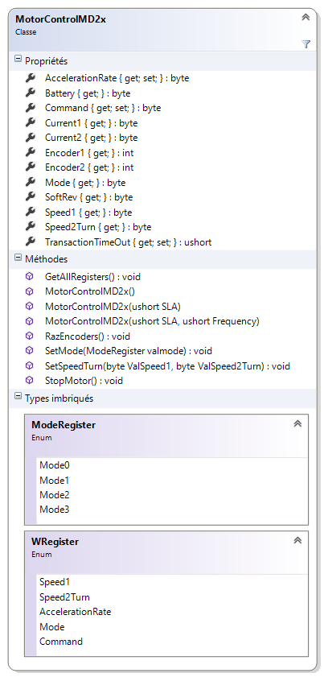
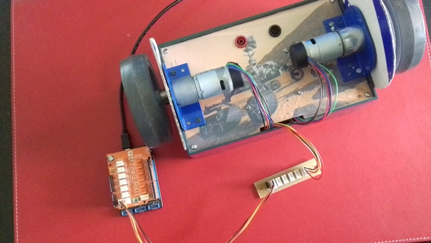

# MD25

## Description

Source code.

A **.NETMF v4.3** class write for MD25 board : Dual 12Volt 2.8Amp H Bridge Motor Drive for I²C-bus. 

This class is also in the [MicroToolsKit](https://www.nuget.org/packages/WEBGE.Microtoolskit/) **library**. Download at [nuget.org](https://www.nuget.org).

## Hardware

**Targets**: Netduino, Netduino2 plus, Netduino 3, FEZ PANDA 3 et COBRA 3.

## Software

* **Language** : C#
* **Framework used** : .NETMF 4.3
* **IDE** : Visual Studio Community 2015
* **xml** : documentation inside class  
* **Exception** : if transaction failed

## Visual Studio solution

* **MD25**

  * **MD25** : .NetMF class

* **Netduino** : class test program for Netduino board
* **FezPanda** : class test program for Fez Panda board

## Assembly

## Videos on youtube

* [Benchmark](https://youtu.be/gIigdBUdnPI)
* [Position error measurement](https://youtu.be/fLUx9E7sq2s)
* [Solar exploration robot](https://youtu.be/ovv2w9cWWYM)

## Keywords

I²C Bus, Motor Drive, Netduino, FEZ, PANDA, COBRA, C#, NETMF, Visual Studio.

## Tested on

Fez Panda III, Netduino2 plus, Netduino 3

## Todo list

Set speed1, speed2Turn, mode registers
Change I2C address 

## To get started

* See [MD25 GitHub Page](http://webge.github.io/MD25/) (French).

## Wiki

* [C# embarqué et .NetMF v4.3 pour les cartes Netduino et GHI FEZ](http://webge.fr/dokuwiki/doku.php?id=netmf43:accueilnetmf)(French).

## Project site

* [MicroToolsKit library](http://webge.dyndns-server.com/dokuwiki/doku.php?id=netmf43:6_microtoolskit) (English)

**Maintened by** [WebGe](mailto:philippemariano@gmail.com)
